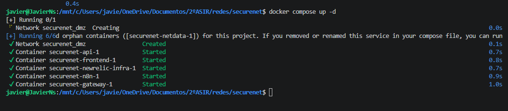
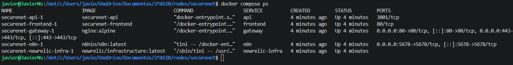
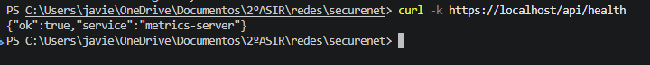
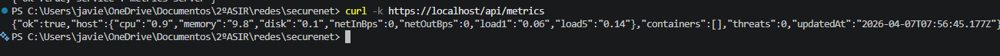
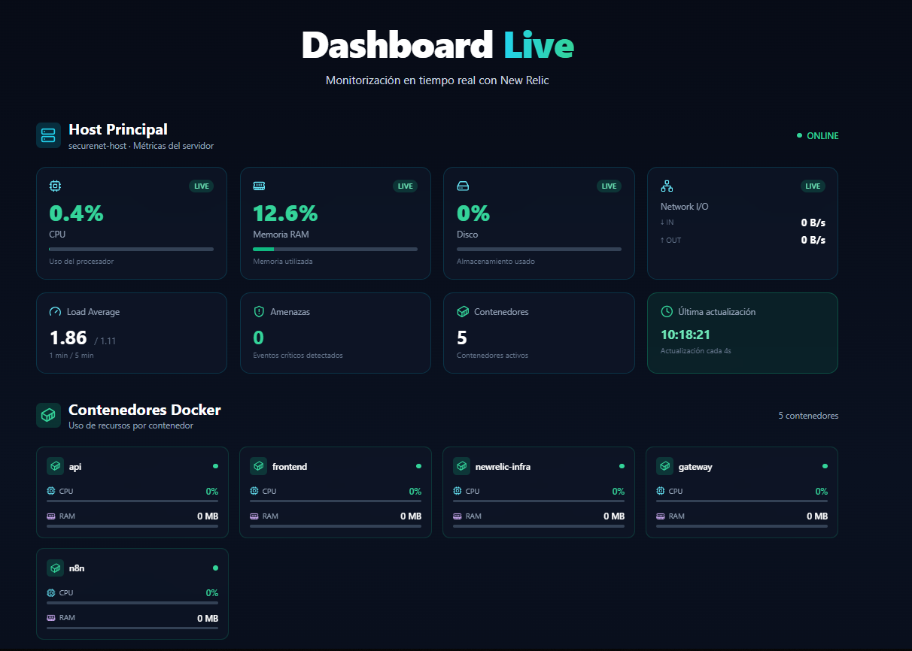
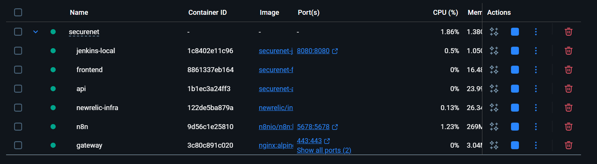
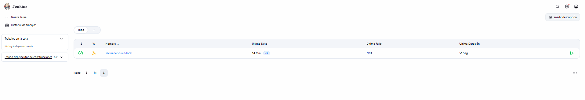

# Guía de Implementación: Migración de SecureNet a Cloud

## Checklist de Implementación

### Fase 0: Preparación (Semana 1)

- [ ] Revisar documentacion (README, ARCHITECTURE, POWERUPS)
- [ ] Validar credenciales AWS (configurar `aws-cli`)
- [ ] Clonar repositorio `feature/terraform`
- [ ] Instalar Terraform localmente
- [ ] Generar SSH keypair para AWS
- [ ] Preparar variables en `terraform.tfvars`

**Comandos:**
```bash
# Instalar Terraform (Windows PowerShell)
choco install terraform  # o descargar desde terraform.io

# Configurar AWS CLI
aws configure
# Ingresar: Access Key, Secret Key, region (eu-west-3)

# Generar SSH key (una sola vez)
ssh-keygen -t rsa -b 4096 -f ~/.ssh/id_jenkins

# Exportar clave pública
ssh-keygen -y -f ~/.ssh/id_jenkins > ~/.ssh/id_jenkins.pub
```

---

### Fase 1: Despliegue en Laboratorios (Semana 1-2)

#### Paso 1: Inicialización de Terraform

```bash
cd terraform
terraform init
```

**Resultado esperado:**
```
✓ Terraform has been successfully initialized!
```

#### Paso 2: Comprobar que Docker Compose funciona en local

Antes de desplegar a la nube, verifica que la configuración de Docker funciona correctamente en tu máquina local:

```bash
# Volver al directorio raíz del proyecto
cd ..

# Configurar variables de entorno temporales (usa valores de prueba)
cp .env.example .env

# Editar .env - Comenta o elimina New Relic si no tienes credenciales
# NEW_RELIC_LICENSE_KEY=your_license_key_here
# NEW_RELIC_ACCOUNT_ID=your_account_id_here

# Levantar los servicios
docker compose up -d

# Verificar que los contenedores están corriendo
docker compose ps


```



**Probar endpoints:**
```bash

# Health check
curl -k https://localhost/api/health

# Métricas
curl -k https://localhost/api/metrics

# Si hay algún problema, revisar logs
docker compose logs gateway
docker compose logs api
docker compose logs frontend
```



**Detener servicios:**
```bash
docker compose down
```

**✅ Verificaciones importantes:**
- [ ] Todos los contenedores están en estado `Up`
- [ ] El endpoint `/api/health` responde con status 200
- [ ] El endpoint `/api/metrics` devuelve JSON con métricas
- [ ] No hay errores críticos en los logs

**⚠️ Problemas comunes:**

| Problema | Solución |
|----------|----------|
| `newrelic-infra` sale con error | Comenta el servicio en `docker-compose.yml` o añade credenciales válidas en `.env` |
| `gateway` falla por puerto 80/443 ocupado | Detén Apache/IIS: `sudo systemctl stop apache2` o `net stop was /y` |
| `Error: no such file cert.pem` | Ejecuta `bash scripts/generate-certs.sh` |

#### Paso 3: Planificación

```bash
terraform plan -out=tfplan
```

**Revisar salida:**
- Debe mostrar `aws_instance.jenkins_aws`
- Debe mostrar `aws_security_group.jenkins`
- Debe mostrar `aws_key_pair.ssh_key`

#### Paso 4: Aplicación

```bash
terraform apply tfplan
```

**Verificar:**
- [ ] Instancia Jenkins creada en EC2
- [ ] Security group configurado
- [ ] IP pública asignada
- [ ] Estado Terraform guardado como `terraform.tfstate`

#### Paso 5: Validación

```bash
# Obtener IP pública
terraform output ip_public_jenkins_aws

# SSH a la instancia
ssh -i ~/.ssh/id_jenkins ec2-user@<public-ip>

# Verificar logs de bootstrap
cat /var/log/user-data.log

# Verificar Jenkins running
sudo docker ps

# Verificar healthcheck
cat /opt/jenkins/.user_data_ran
```

#### Paso 6: Acceso a Jenkins

```
Abrir navegador: http://<public-ip>:8080

Obtener password inicial:
cat /opt/jenkins/docker-compose.yaml
# O dentro del contenedor:
sudo docker exec jenkins cat /var/jenkins_home/secrets/initialAdminPassword
```

---

### Fase 2: Configuración de Jenkins (Semana 2-3)

#### Paso 1: Setup Inicial

1. Copiar contraseña de `initialAdminPassword`
2. Seleccionar "Install suggested plugins"
3. Crear usuario admin
4. Salvar configuración

#### Paso 2: Configurar Credenciales Git

1. Jenkins → Manage Jenkins → Manage Credentials
2. Add Credentials → SSH Key
3. Ingresar: Username (git), Private Key (id_jenkins contenido)

#### Paso 3: Crear First Pipeline

```groovy
pipeline {
    agent any
    
    stages {
        stage('Clone') {
            steps {
                git credentialsId: 'git-ssh',
                    url: 'git@github.com:Sniifeerns/securenet.git',
                    branch: 'feature/terraform'
            }
        }
        
        stage('Terraform Plan') {
            steps {
                dir('terraform') {
                    sh 'terraform plan'
                }
            }
        }
    }
}
```

---

### Fase 3: Preparación Segunda VM (Semana 3)

#### Paso 1: Crear Script `docker_app.sh`

```bash
# terraform/scripts/docker_app.sh

#!/bin/bash
set -euxo pipefail

# Log user-data output
exec > >(tee /var/log/user-data.log | logger -t user-data -s) 2>&1

# Update system
sudo dnf update -y
sudo dnf install -y docker git curl

# Enable Docker
sudo systemctl enable --now docker
sudo usermod -aG docker ec2-user

# Install Docker Compose plugin
if ! sudo docker compose version >/dev/null 2>&1; then
  sudo mkdir -p /usr/local/lib/docker/cli-plugins
  sudo curl -SL "https://github.com/docker/compose/releases/latest/download/docker-compose-linux-x86_64" \
    -o /usr/local/lib/docker/cli-plugins/docker-compose
  sudo chmod +x /usr/local/lib/docker/cli-plugins/docker-compose
fi

# Create app directory
sudo mkdir -p /opt/app

# Generate docker-compose for app services
sudo tee /opt/app/docker-compose.yaml > /dev/null <<'EOF'
version: '3.8'

services:
  # Placeholder para aplicaciones
  # Serán desplegadas via Jenkins CI/CD
  
volumes:
  app_data:
EOF

echo "$(date -Is) user_data completed" | sudo tee /opt/app/.user_data_ran > /dev/null
```

#### Paso 2: Crear recurso EC2 para Apps en Terraform

```hcl
# En aws_compute.tf

resource "aws_instance" "app_aws" {
    ami = data.aws_ami.amazon_linux.id
    instance_type = "t3.medium"
    tags = {
        Name = "app-aws"
    }
    user_data = file("${path.module}/scripts/docker_app.sh")
    user_data_replace_on_change = true
    vpc_security_group_ids = [aws_security_group.app.id]
    key_name = aws_key_pair.ssh_key.key_name
}

resource "aws_security_group" "app" {
    name       = "app"
    description = "Security group for App instance"
    
    ingress {
        from_port   = 22
        to_port     = 22
        protocol    = "tcp"
        cidr_blocks = ["0.0.0.0/0"]  # LABS only
    }
    
    # Puertos para aplicaciones
    ingress {
        from_port   = 3000
        to_port     = 3000
        protocol    = "tcp"
        cidr_blocks = ["0.0.0.0/0"]
    }
    
    ingress {
        from_port   = 5432
        to_port     = 5432
        protocol    = "tcp"
        cidr_blocks = ["172.31.0.0/16"]  # VPC CIDR (DB privada)
    }
    
    egress {
        from_port   = 0
        to_port     = 0
        protocol    = "-1"
        cidr_blocks = ["0.0.0.0/0"]
    }
}
```

#### Paso 3: Implementar CI/CD Local con Jenkins

**Objetivo:** Configurar Jenkins para construir imágenes Docker localmente que luego serán desplegadas en AWS ECR.

##### 3.1: Crear Dockerfile para cada servicio

```dockerfile
# En el directorio raíz del proyecto, crear:
# Dockerfile.api
FROM node:18-alpine
WORKDIR /app
COPY package*.json ./
RUN npm ci --only=production
COPY . .
EXPOSE 3000
CMD ["node", "server/api.js"]

# Dockerfile.frontend
FROM node:18-alpine AS builder
WORKDIR /app
COPY package*.json ./
RUN npm ci
COPY . .
RUN npm run build

FROM nginx:alpine
COPY --from=builder /app/dist /usr/share/nginx/html
EXPOSE 80
CMD ["nginx", "-g", "daemon off;"]

# Dockerfile.gateway
FROM nginx:alpine
COPY docker/gateway/nginx.conf /etc/nginx/nginx.conf
COPY docker/gateway/ssl /etc/nginx/ssl
EXPOSE 80 443
CMD ["nginx", "-g", "daemon off;"]
```





##### 3.2: Crear Jenkins Pipeline para Build Local

```groovy
// Jenkinsfile
pipeline {
    agent any
    
    environment {
        DOCKER_REGISTRY = 'local'
        IMAGE_TAG = "${BUILD_NUMBER}"
    }
    
    stages {
        stage('Clone Repository') {
            steps {
                git credentialsId: 'git-ssh',
                    url: 'git@github.com:Sniifeerns/securenet.git',
                    branch: 'feature/terraform'
            }
        }
        
        stage('Build Docker Images') {
            parallel {
                stage('Build API') {
                    steps {
                        sh '''
                            docker build -t securenet-api:${IMAGE_TAG} -f Dockerfile.api .
                            docker tag securenet-api:${IMAGE_TAG} securenet-api:latest
                        '''
                    }
                }
                stage('Build Frontend') {
                    steps {
                        sh '''
                            docker build -t securenet-frontend:${IMAGE_TAG} -f Dockerfile.frontend .
                            docker tag securenet-frontend:${IMAGE_TAG} securenet-frontend:latest
                        '''
                    }
                }
                stage('Build Gateway') {
                    steps {
                        sh '''
                            docker build -t securenet-gateway:${IMAGE_TAG} -f Dockerfile.gateway .
                            docker tag securenet-gateway:${IMAGE_TAG} securenet-gateway:latest
                        '''
                    }
                }
            }
        }
        
        stage('Test Images') {
            steps {
                sh '''
                    docker images | grep securenet
                    echo "Images built successfully"
                '''
            }
        }
        
        stage('Save Images Locally') {
            steps {
                sh '''
                    mkdir -p /opt/jenkins/images
                    docker save securenet-api:latest -o /opt/jenkins/images/api.tar
                    docker save securenet-frontend:latest -o /opt/jenkins/images/frontend.tar
                    docker save securenet-gateway:latest -o /opt/jenkins/images/gateway.tar
                '''
            }
        }
    }
    
    post {
        success {
            echo 'Docker images built and saved successfully!'
        }
        failure {
            echo 'Build failed. Check logs for details.'
        }
    }
}
```

##### 3.3: Configurar Jenkins Job

1. **Crear nuevo Pipeline Job:**
   - Jenkins → New Item → Pipeline
   - Nombre: "securenet-build-local"

2. **Configurar Pipeline:**
   - Pipeline definition: Pipeline script from SCM
   - SCM: Git
   - Repository URL: git@github.com:Sniifeerns/securenet.git
   - Branch: feature/terraform
   - Script Path: Jenkinsfile

3. **Ejecutar Build:**
   ```bash
   # Desde Jenkins UI, click "Build Now"
   # O via CLI:
   curl -X POST http://<jenkins-ip>:8080/job/securenet-build-local/build \
     --user admin:admin
   ```


##### 3.4: Validar Build Local

```bash
# SSH a Jenkins
ssh -i ~/.ssh/id_jenkins ec2-user@<jenkins-ip>

# Verificar imágenes
docker images | grep securenet

# Verificar archivos .tar guardados
ls -lh /opt/jenkins/images/

# Probar una imagen localmente
docker run -d -p 3001:3000 --name test-api securenet-api:latest
curl http://localhost:3001/health
docker stop test-api && docker rm test-api
```

**✅ Checklist Fase 3:**
- [ ] Dockerfiles creados para api, frontend y gateway
- [ ] Jenkinsfile configurado con pipeline de build
- [ ] Job de Jenkins creado y ejecutado exitosamente
- [ ] Imágenes Docker construidas y guardadas localmente
- [ ] Imágenes probadas y funcionando correctamente

---

### Fase 4: Despliegue en AWS con ECR (Semana 4)

#### Paso 1: Crear Repositorios ECR en Terraform

```hcl
# En terraform/aws_ecr.tf (crear nuevo archivo)

resource "aws_ecr_repository" "api" {
  name                 = "securenet-api"
  image_tag_mutability = "MUTABLE"
  
  image_scanning_configuration {
    scan_on_push = true
  }
  
  tags = {
    Name = "securenet-api"
    Environment = "labs"
  }
}

resource "aws_ecr_repository" "frontend" {
  name                 = "securenet-frontend"
  image_tag_mutability = "MUTABLE"
  
  image_scanning_configuration {
    scan_on_push = true
  }
  
  tags = {
    Name = "securenet-frontend"
    Environment = "labs"
  }
}

resource "aws_ecr_repository" "gateway" {
  name                 = "securenet-gateway"
  image_tag_mutability = "MUTABLE"
  
  image_scanning_configuration {
    scan_on_push = true
  }
  
  tags = {
    Name = "securenet-gateway"
    Environment = "labs"
  }
}

# Outputs
output "ecr_api_url" {
  value = aws_ecr_repository.api.repository_url
}

output "ecr_frontend_url" {
  value = aws_ecr_repository.frontend.repository_url
}

output "ecr_gateway_url" {
  value = aws_ecr_repository.gateway.repository_url
}
```

#### Paso 2: Crear Política IAM para Jenkins

```hcl
# En terraform/aws_iam.tf (crear nuevo archivo)

resource "aws_iam_role" "jenkins_ecr" {
  name = "jenkins-ecr-role"

  assume_role_policy = jsonencode({
    Version = "2012-10-17"
    Statement = [
      {
        Action = "sts:AssumeRole"
        Effect = "Allow"
        Principal = {
          Service = "ec2.amazonaws.com"
        }
      }
    ]
  })
}

resource "aws_iam_role_policy" "jenkins_ecr_policy" {
  name = "jenkins-ecr-policy"
  role = aws_iam_role.jenkins_ecr.id

  policy = jsonencode({
    Version = "2012-10-17"
    Statement = [
      {
        Effect = "Allow"
        Action = [
          "ecr:GetAuthorizationToken",
          "ecr:BatchCheckLayerAvailability",
          "ecr:GetDownloadUrlForLayer",
          "ecr:BatchGetImage",
          "ecr:PutImage",
          "ecr:InitiateLayerUpload",
          "ecr:UploadLayerPart",
          "ecr:CompleteLayerUpload"
        ]
        Resource = "*"
      }
    ]
  })
}

resource "aws_iam_instance_profile" "jenkins_ecr" {
  name = "jenkins-ecr-profile"
  role = aws_iam_role.jenkins_ecr.name
}
```

#### Paso 3: Asociar IAM Role a Jenkins Instance

```hcl
# En terraform/aws_compute.tf, modificar aws_instance.jenkins_aws

resource "aws_instance" "jenkins_aws" {
  # ... configuración existente ...
  
  # Añadir esta línea:
  iam_instance_profile = aws_iam_instance_profile.jenkins_ecr.name
}
```

#### Paso 4: Aplicar cambios de Terraform

```bash
cd terraform

# Planificar
terraform plan

# Aplicar
terraform apply

# Obtener URLs de ECR
terraform output ecr_api_url
terraform output ecr_frontend_url
terraform output ecr_gateway_url
```

#### Paso 5: Actualizar Pipeline de Jenkins para Push a ECR

```groovy
// Jenkinsfile - actualizado
pipeline {
    agent any
    
    environment {
        AWS_REGION = 'eu-west-3'
        ECR_API = sh(script: "terraform -chdir=terraform output -raw ecr_api_url", returnStdout: true).trim()
        ECR_FRONTEND = sh(script: "terraform -chdir=terraform output -raw ecr_frontend_url", returnStdout: true).trim()
        ECR_GATEWAY = sh(script: "terraform -chdir=terraform output -raw ecr_gateway_url", returnStdout: true).trim()
        IMAGE_TAG = "${BUILD_NUMBER}"
    }
    
    stages {
        stage('Clone Repository') {
            steps {
                git credentialsId: 'git-ssh',
                    url: 'git@github.com:Sniifeerns/securenet.git',
                    branch: 'feature/terraform'
            }
        }
        
        stage('ECR Login') {
            steps {
                sh '''
                    aws ecr get-login-password --region ${AWS_REGION} | \
                    docker login --username AWS --password-stdin ${ECR_API%/*}
                '''
            }
        }
        
        stage('Build and Push Images') {
            parallel {
                stage('API') {
                    steps {
                        sh '''
                            docker build -t ${ECR_API}:${IMAGE_TAG} -f Dockerfile.api .
                            docker tag ${ECR_API}:${IMAGE_TAG} ${ECR_API}:latest
                            docker push ${ECR_API}:${IMAGE_TAG}
                            docker push ${ECR_API}:latest
                        '''
                    }
                }
                stage('Frontend') {
                    steps {
                        sh '''
                            docker build -t ${ECR_FRONTEND}:${IMAGE_TAG} -f Dockerfile.frontend .
                            docker tag ${ECR_FRONTEND}:${IMAGE_TAG} ${ECR_FRONTEND}:latest
                            docker push ${ECR_FRONTEND}:${IMAGE_TAG}
                            docker push ${ECR_FRONTEND}:latest
                        '''
                    }
                }
                stage('Gateway') {
                    steps {
                        sh '''
                            docker build -t ${ECR_GATEWAY}:${IMAGE_TAG} -f Dockerfile.gateway .
                            docker tag ${ECR_GATEWAY}:${IMAGE_TAG} ${ECR_GATEWAY}:latest
                            docker push ${ECR_GATEWAY}:${IMAGE_TAG}
                            docker push ${ECR_GATEWAY}:latest
                        '''
                    }
                }
            }
        }
        
        stage('Deploy to App Instance') {
            steps {
                sh '''
                    APP_IP=$(terraform -chdir=terraform output -raw ip_public_app_aws)
                    
                    # Copiar docker-compose actualizado
                    scp -i ~/.ssh/id_jenkins docker-compose.ecr.yml ec2-user@${APP_IP}:/opt/app/docker-compose.yml
                    
                    # Hacer deploy
                    ssh -i ~/.ssh/id_jenkins ec2-user@${APP_IP} "
                        cd /opt/app
                        aws ecr get-login-password --region ${AWS_REGION} | docker login --username AWS --password-stdin ${ECR_API%/*}
                        docker compose pull
                        docker compose up -d
                    "
                '''
            }
        }
    }
    
    post {
        success {
            echo 'Images pushed to ECR and deployed successfully!'
        }
        failure {
            echo 'Pipeline failed. Check logs for details.'
        }
    }
}
```

#### Paso 6: Crear docker-compose para ECR

```yaml
# docker-compose.ecr.yml
version: '3.8'

services:
  api:
    image: <ACCOUNT_ID>.dkr.ecr.eu-west-3.amazonaws.com/securenet-api:latest
    container_name: api
    ports:
      - "3000:3000"
    environment:
      - NODE_ENV=production
    restart: unless-stopped

  frontend:
    image: <ACCOUNT_ID>.dkr.ecr.eu-west-3.amazonaws.com/securenet-frontend:latest
    container_name: frontend
    ports:
      - "80:80"
    restart: unless-stopped

  gateway:
    image: <ACCOUNT_ID>.dkr.ecr.eu-west-3.amazonaws.com/securenet-gateway:latest
    container_name: gateway
    ports:
      - "443:443"
      - "8080:80"
    depends_on:
      - api
      - frontend
    restart: unless-stopped
```

#### Paso 7: Validar Despliegue en AWS

```bash
# Obtener IP de la instancia App
terraform output ip_public_app_aws

# SSH a la instancia
ssh -i ~/.ssh/id_jenkins ec2-user@<app-ip>

# Verificar contenedores corriendo
docker ps

# Verificar logs
docker logs api
docker logs frontend
docker logs gateway

# Probar endpoints
curl http://localhost:3000/health
curl http://localhost/
```

**✅ Checklist Fase 4:**
- [ ] Repositorios ECR creados en AWS
- [ ] IAM Role configurado para Jenkins
- [ ] Pipeline actualizado para push a ECR
- [ ] Imágenes subidas correctamente a ECR
- [ ] Instancia App desplegada con docker-compose desde ECR
- [ ] Servicios accesibles y funcionando en AWS

---

### Fase 5: Implementar Power Apps (Mes 1)

#### Paso 1: Crear app en Power Apps

1. Crear Canvas App web en Power Apps.
2. Anadir una vista de estado de instancias (Jenkins y App).
3. Anadir una vista de estado de contenedores.

#### Paso 2: Crear flujos en Power Automate

1. Flujo para consultar estado de instancias.
2. Flujo para consultar estado de contenedores.
3. Flujo para acciones basicas: start, stop y restart.

#### Paso 3: Integrar acciones basicas

1. Conectar Power Automate con endpoints o scripts controlados en AWS.
2. Mostrar resultado en Power Apps (exito/fallo).
3. Registrar acciones basicas para auditoria.

#### Paso 4: Validacion

1. Verificar que la app muestra estado real.
2. Reiniciar Jenkins desde la app y confirmar recuperacion.
3. Verificar que acciones no autorizadas se bloquean.

---

### Fase 6: Testing de Disaster Recovery (Semana 5)

#### Paso 1: Simular fallo

```bash
# SSH a Jenkins
ssh ec2-user@<jenkins-ip>

# Simular crash
sudo docker stop jenkins

# Verificar estado
sudo docker ps
```

#### Paso 2: Recuperación

```bash
# Reiniciar manualmente
sudo docker start jenkins

# O via Power Apps
# (accion Restart desde la interfaz web)
```

#### Paso 3: Validar

```bash
curl http://<jenkins-ip>:8080/api/json

# Debe retornar JSON (200 OK)
```

---

### Fase 7: Preparación Migración a Producción (Mes 2)

#### Paso 1: Auditoría de Seguridad

- [ ] Review Security Groups (restringir 0.0.0.0/0)
- [ ] Habilitar VPC Flow Logs
- [ ] Configurar CloudTrail
- [ ] Implementar backup de Jenkins Home volume

#### Paso 2: Configurar Backend Remoto

```hcl
# backend.tf
terraform {
  backend "s3" {
    bucket         = "securenet-terraform-state"
    key            = "jenkins/terraform.tfstate"
    region         = "eu-west-3"
    encrypt        = true
    dynamodb_table = "terraform-locks"
  }
}
```

#### Paso 3: Crear cuenta AWS Producción

- [ ] Nueva AWS Account
- [ ] Configurar AWS Organizations
- [ ] Setup IAM roles
- [ ] Configurar billing alerts

#### Paso 4: Validar Terraform en Producción

```bash
# Con credenciales de producción
export AWS_PROFILE=production

terraform init
terraform plan -var-file=production.tfvars
```

---

## Troubleshooting Commons

### Terraform init falla

```bash
# Error: No authentication via AWS CLI
aws configure
# Ingresar credenciales

# Error: Provider download falló
rm -rf .terraform
terraform init
```

### SSH connection refused

```bash
# Verificar security group
aws ec2 describe-security-groups --group-names jenkins

# Verificar key permissions
chmod 600 ~/.ssh/id_jenkins

# Test conexión
ssh -i ~/.ssh/id_jenkins -v ec2-user@<ip>
```

### Jenkins no levanta

```bash
ssh ec2-user@<ip>

# Ver logs
tail -f /var/log/user-data.log

# Ver Docker logs
sudo docker logs jenkins

# Reiniciar
sudo docker restart jenkins

# Ver healthcheck
cat /opt/jenkins/.user_data_ran
```

### Power Apps permission denied

```bash
# Problema: usuario no está en grupo docker
sudo usermod -aG docker ec2-user

# Requiere logout/login
exit
ssh ec2-user@<ip>

# Test
docker ps
```

---

## Documentos Relacionados

- [README.md](./README.md) - Visión general de la migración
- [ARCHITECTURE.md](./ARCHITECTURE.md) - Diseño técnico detallado
- [POWERUPS.md](./POWERUPS.md) - Roadmap de Power Apps para operaciones basicas

---

## Contacto y Preguntas

- Repository: https://github.com/Sniifeerns/securenet
- Branch: `feature/terraform`
- Issues: GitHub Issues

---

## Versión del Documento

- **Version**: 1.0
- **Fecha**: Marzo 2026
- **Autor**: SecureNet DevOps Team
- **Status**: Ready for Labs Phase 1

